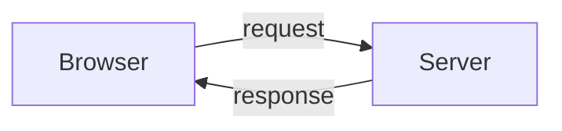
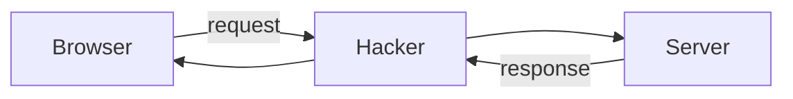

# Exercise 3a: spy on requests and responses

## What you need to know

We've seen that there is a web browser, which makes a request to a web server,
and receives a response.



That request, and its response, travels across wires and through airwaves.
Maybe it contains your credit card number, your secret crush, or your health
details.

What if someone is listening in?



Let's be such a hacker! We're going to use a tool called `tcpdump` which can
spy on *all the network traffic*.

(`tcpdump` means `TCP` dump. `TCP` is the ["transmission control protocol", which
is an agreement about how computers can communicate over the internet.](https://en.wikipedia.org/wiki/Transmission_Control_Protocol))

## Getting started

Make an HTML page within `src/server/pages/crush.html` with your secret crush, in HTML.

## Running `tcpdump`

The computer you're using probably has several **interfaces**. That is, ways
it can talk over the network. It might have a wired network socket, and it might
also be able to work on wireless ("WiFi" networks).

Run this command to find out what interfaces you have:

```
sudo tcpdump -D
```

> [!TIP]
> Like in exercise 1, you need to run several commands at once. Once
> a command is running, the terminal won't act on other commands you
> give it. You can create
> several terminal windows to run several commands, or after you've run a
> command you can press Control-Z and then run the command `bg`

Hopefully, one of them is labelled "loopback". That's the one we want today,
which enables us to spy on a browser and server running on your computer.
What's it called? It might be called `lo0`. Remember that.

Now run

```
sudo tcpdump -i lo0 -A 'tcp port 8000'
```

(You might need to swap `lo0` with whatever your loopback interface was called.)

> [!TIP]
> You can press the Up arrow to edit a command you previously ran.

Imagine you're doing this on a computer that's somewhere in between the browser
and server. It would work just the same way.

## Spying on an HTTP request

Run the simple web browser. Navigate to `http://localhost:8000/crush.html`.

You should see the HTTP request go past, and the response.

Here's an example request (yours will look slightly different):

```
GET /crush.html HTTP/1.1
Host: localhost:8000
User-Agent: python-requests/2.31.0
Accept-Encoding: gzip, deflate
Accept: */*
Connection: keep-alive
```

Here's an example response (again yours will be a bit different):

```
HTTP/1.0 200 OK
Server: SimpleHTTP/0.6 Python/3.12.2
Date: Fri, 16 Feb 2024 16:43:01 GMT
Content-type: text/html
Content-Length: 344
Last-Modified: Fri, 16 Feb 2024 16:13:49 GMT

<html>
<head>
<title>About my crush</title>
</head>
<body>
<p>My secret crush is Elsa from Frozen.</p>
</body>
</html>
```

This is the information flowing over the network between the browser and the
server.

We're doing it on the same computer as the browser and server, but your
information passes across dozens of computers on the way, and normally,
any of them could spy.

# Questions to answer

* In the request, what HTTP version is being used?
* What's the "content type" of the response from the server? (HTTP servers can
  supply images, video, and audio as well as HTML - you might have noticed them)


What do we do?

Type Control-C to zap `tcpdump` when you're finished.