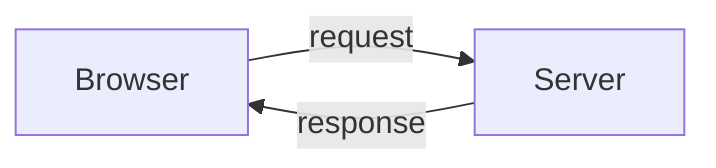
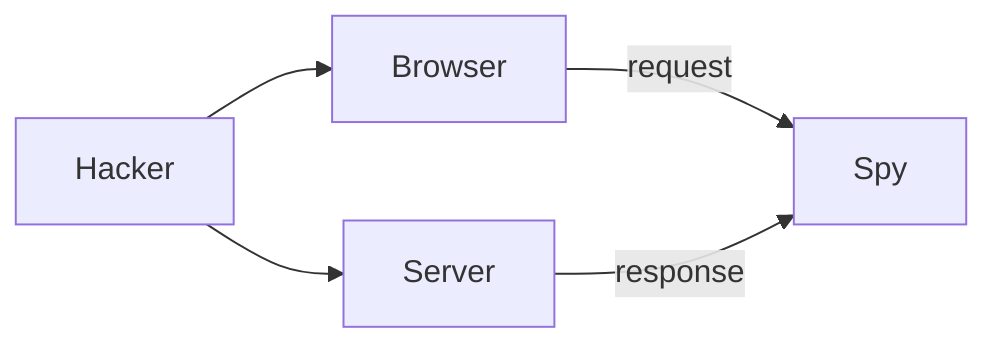

# Exercise 3a: spy on requests and responses

## What you need to know

We've seen that there is a web browser, which makes a request to a web server,
and receives a response.


```mermaid
graph LR;
    Browser-- request -->Server;
    Server-- response -->Browser;
```

That request, and its response, travels across wires and through airwaves.
Maybe it contains your credit card number, your secret crush, or your health
details.

What if someone is listening in?


```mermaid
graph LR;
    Browser-- request -->Spy;
    Hacker --> Server
    Server-- response -->Spy;
    Hacker-->Browser;
```

Let's be such a hacker! We're going to use a tool called `spy.py` which can
spy on the requests and responses as they go past.

## Getting started

Make an HTML page within `src/server/pages/crush.html` with your secret crush, in HTML.

## Running `spy.py`

In a previous exercise, you had both the browser and the server running at the
same time. You may have had two terminals running. You will need a third for this
- don't forget to `cd` if necessary in the new terminal.

So, while you _still have the browser and server running_, also start

`python3 src/spy/spy.py 8001 8000`

## Spying on an HTTP request

Run the simple web browser. Navigate to `http://localhost:8001/crush.html`.

Note that it's 8001 not 8000!

You should see the HTTP request go past, and the response.

Here's an example request (yours will look slightly different):

```
GET /crush.html HTTP/1.1
Host: localhost:8000
User-Agent: python-requests/2.31.0
Accept-Encoding: gzip, deflate
Accept: */*
Connection: keep-alive
```

Here's an example response (again yours will be a bit different):

```
HTTP/1.0 200 OK
Server: SimpleHTTP/0.6 Python/3.12.2
Date: Fri, 16 Feb 2024 16:43:01 GMT
Content-type: text/html
Content-Length: 344
Last-Modified: Fri, 16 Feb 2024 16:13:49 GMT

<html>
<head>
<title>About my crush</title>
</head>
<body>
<p>My secret crush is Elsa from Frozen.</p>
</body>
</html>
```

This is the information flowing over the network between the browser and the
server.

We're doing it on the same computer as the browser and server, but your
information passes across dozens of computers on the way, and normally,
any of them could spy.

# Questions to answer

* In the request, what HTTP version is being used?
* What's the "content type" of the response from the server? (HTTP servers can
  supply images, video, and audio as well as HTML - you might have noticed them)


What do we do?

# What's with 8000 and 8001?

These are "port numbers". Different applications on your computer might be "listening" for
network connections on different "ports". Our server was listening on port 8000 - that's
why it says 8000 within

`http://localhost:8000/`.

Our spy is listening on port 8001, and then it's passing on any connections to port 8000.
So the data flows via the spy first and then onto the server.
